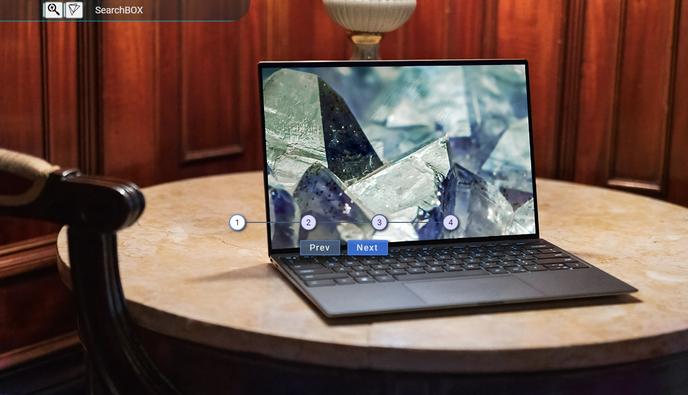

# [Blurry-page-load](https://michal-w-dev.github.io/Blurry-page-load/)

<ul><b> Blurry page load </b>, after which, the background image is replaced with one with high quality.
<li> animated navbar </li>
  <li> animated input (autofocus, Unicode icons in placeholder), 
  <ul>
    <li> to hide single input click button again, to hide both inputs, click outside of navbar  </li>
  </ul>
</li>
<li> animated steps (previous, next) </li>
</ul>

 

